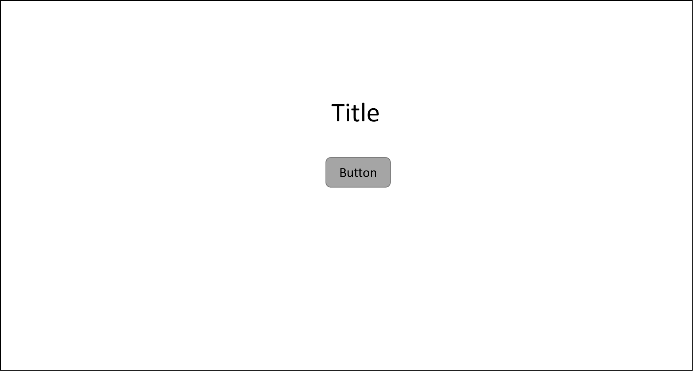
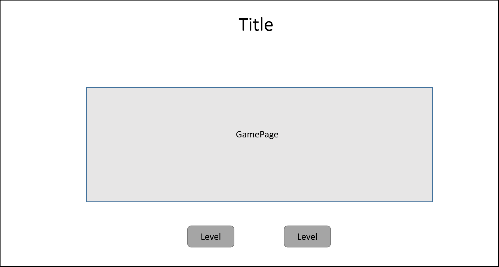
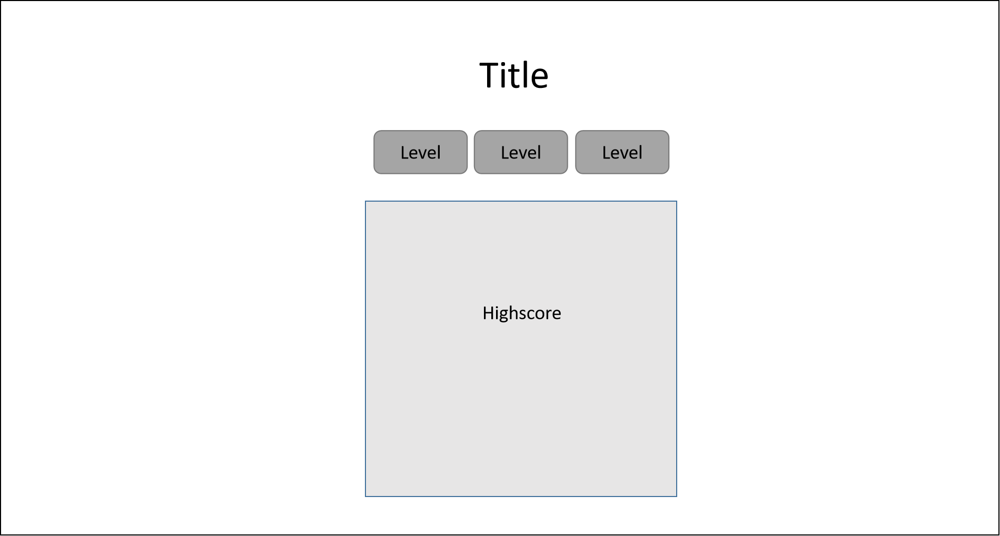
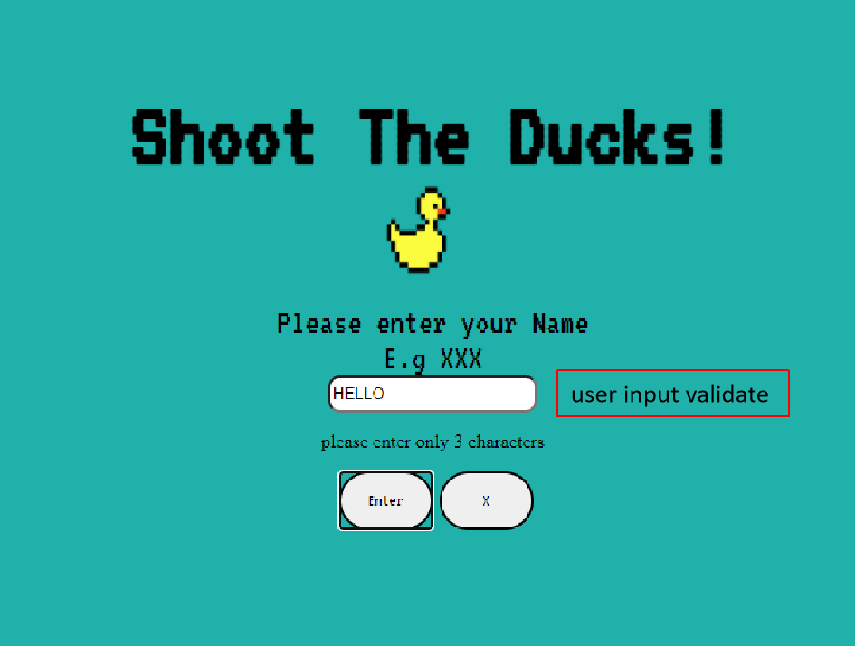
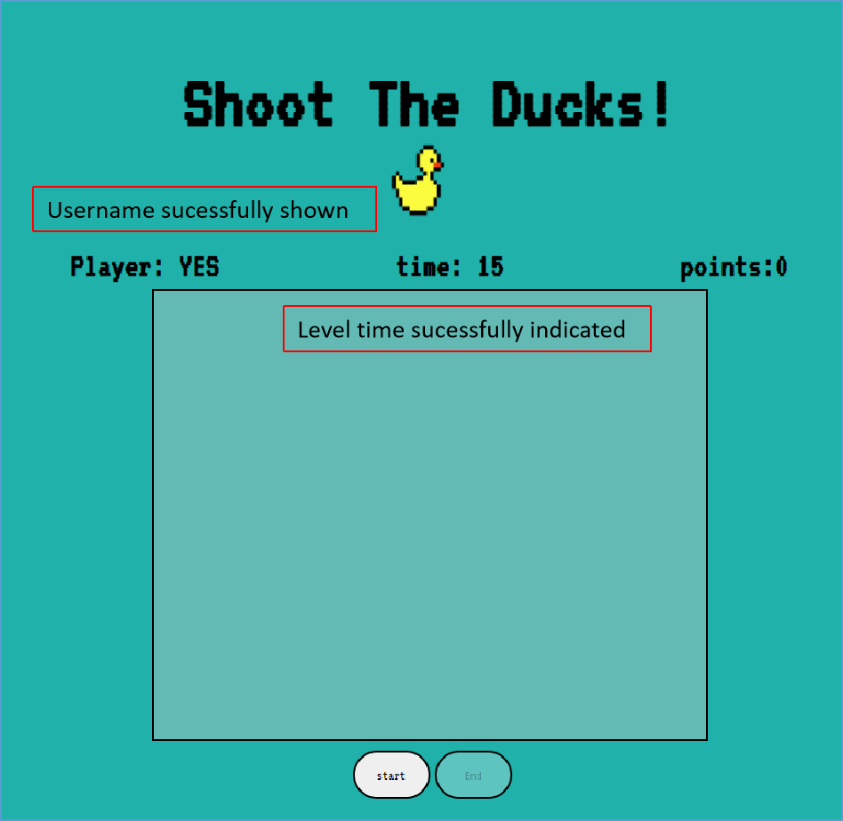

# TGC9-FrontEnd-Assignment2

Reactive Frontend Frameworks and RESTful API Development

# Shoot The Ducks
A simple game to shoot the ducks that appear in the farm. This game will train the reaction and clicking accuracy of the players. Creating a fun and enjoyable training environment for first person shooter training.

# Context
In Assignment 2,  we neet to create an interactive web application using a reactive framework (such as Vue or React) and our own RESTful API using Mongo and Express.

As it will be a single page aplication, the following are what will be shown upon users interactions with the page buttons:
* FrontPage - After entering the page, user will be greeted with the title of the page and a single enter button.
* User Input - Before the game can begin, user will be prompted to enter a three characters only name for storing of points in the database and they will be able to select the level difficulty. 
* Game Page - At the game page, user will be able to see their name, level selected and the points obtained. Upon clicking the start button, user will then be able to interact with the game.
* Highscore - The highscore page will display the top 10 scores for each levels. 

# Demo
The link to the project demo can be accessed here:

<a href="https://wonghongkeat.github.io/TGC9-FrontEnd-Assignment2/">https://wonghongkeat.github.io/TGC9-FrontEnd-Assignment2/</a>

# Strategy
A simple shooting game design webpage for user to access and train their shooting accuracy. It is also for people who have free time and looking for a enjoyable but stressfree game to get pass time.

## User's goals
To allow users to train their mouse accuracy and clicking speed and also be able to save their highscores and see how they ranked among other players. 
With the increase in First Person Shooting (FPS) games in the game market, this platform will allow users to train in a stress free environment their reaction time and speed.
This website will also provide as a platform for users to use it to get pass time or to have a way to destress.

### Target Audiences
As this site is set out for either skills training or casual/leisure gaming, the target audience of the site will be as follows:
* FPS gamers.
* causal gamers.
* Normal folks who wants to take a break from work or to relax for a few minutes.

## User Stories
As a user, I will and hope to achieve the following after visiting the website:
* I will hope the site is easy to navigate.
* I will hope that the gameplay and interface is easy to understand.
* I will hope my score will be recorded and I will be able to view and compare my scores with others.
* I want to have fun. 

## Site's Owner goals
Be easily accessible regardless of the device visitor is using.

Allow the user to be able to compete and achieve a top 10 score in every level.

To enable the site to be brightly colored and striking visual. Allow easy navigations in the website and in game. To let the users have a clear direction of the interface and the gameplay.

# Scope
## Functional
Through this website, the user can hope to improve their aiming and clicking skills. 

User who just want to get pass time will find this site simple and a great way to help them destress.

User will be able to compare scores and see if they made it into the top 10.

## Content
As this is a single page application website, the content will be straight forward and simple. The main idea of the website is to let user dive right into the game and start playing straight away.

Some mandatory requirements will include:
* A button for 'New Game'
* A button for 'Highscore'
* Way for the user to input their score after every game.
* Access to the top 10 high scores played on the game.

## Content requirements
The following will be added into the website:
* Front page
* Game page
* Highscore
* New score input

## Content Structure
The page will be group and organised as follows:

1. Front page:
* The User will be greeted with the gamepage and a enter button to enter the site.
* Upon entering, user can choose to either play a new game or to view existing highscores. 

2. Game page:
* At the game page, user will be prompted to enter their name for storing purposes and to select the level of difficulty.
* The page will then display the information and the time of the level together with game board. 
* Upon pressing the start button, the game will then begin. 
* Recording the scores after the game end automatically. 

3. Highscore:
* In the Highscore page, user will be able to select the level of diffculty and view the top 10 scores. 

## Features
In this assignment, I will be implenting a database from MongoDB to store the highscores of everyone that has played the game. Using Express and RESTful API, we will be able to see the scores history of past players and who has the highest score.
Hoping to bring the players a sense of accomplishment and achievments after they leave the website.

# Page Structure and Organize Interactions 

## Skeleton
The sekeleton of the game page will be a single page application using a reactive framework, VueJs.

Although it is a single page layout website, there will still be buttons for the users to click and interact with the page.  

The constant display and graphics on the website will be the title, which will always be shown and in the same position no matter what the users click from the website.

Attached are the skeleton concept drawn out for the page for reference, more concept can be found in the "images" folder.

skeleton1

skeleton5-Game page

skeleton6-Highscore

# Interface design
The constant feature of the page will be the title which will constantly be shown throughout the interaction of the website.
Title will include the game title and a logo. 

## logo 
For the logo, I have choose a classic pixelated rubber duck design.

The image is sourced from google image search 

## fonts
For the fonts, I have also choose a pixelated font to match the design of the duck. 

VT323 fonts - Designed by Peter Hull under google fonts have been selected as the theme of the font.
<a href="https://fonts.google.com/specimen/VT323#standard-styles">https://fonts.google.com/specimen/VT323#standard-styles</a>

## color
colour of the website has been set to LightSeaGreen as it gives a bright contrast to the rubber duck image and it creates a pleasant and playful atmosphere for the user.

# Features

Players will be able to input their name before the start of the game and be able to compare scores and see if they made it to top 10. 
Different levels of difficulty can be selected and enjoy by different players.

## Algorithm

Several algorithms were implemented for the construction of this site, they are listed as follows:
* Filtering
* State Variables
* String processing 
* 1D array traversal
* Final state machine

## Technologies Used
The following list of technologies were use to construct the website:

* VueJs 
    * to create the basic framework for the excution of the website.

* HTML5
   * To create the basic structure of all the pages and for adding content informations.

* GitHub
    * To create a respository for the project and a saving backup option.

* Gitpod
    * Online IDE for the use of all the coding activities.

* Microsoft Powerpoint
    * For drawing of the skeleton of the website

* Respnsive Web Design checker
    * To check if the website is mobile responsive
    * <a href="http://ami.responsivedesign.is/#">Am I Responsive?</a>

* MongoDB Atlas
    * The use of MongoDB atlas as our base database and storing of data.

* Heroku
    * for server deployment, Heroku was used to keep the express API open and running

# Testing
After the creation of the website, testing were made and the following results were achieved:
* User able to input name with only 3 characters.
* Name entered will be stored as record.
* Level can be selected according to user selection. 
* Scores after every game play is successfully stored with the user's name into the database.

## Validating
Using <a href="http://validator.w3.org/">(http://validator.w3.org/)</a> the page was checked and no errors or warnings.

# Deployment
The hosting platform we will be using are: 
* Github 
    * <a href="https://wonghongkeat.github.io/TGC9-FrontEnd-Assignment2/">https://wonghongkeat.github.io/TGC9-FrontEnd-Assignment2/</a>
    * Github pages were use to deploy the VueJs component

* Heroku
    * <a href="https://www.heroku.com/">https://www.heroku.com/</a>
    * Heroku was used to host the database server

# Credits

I would like to thank the following for their guidance throughout this whole project:
* Mr Paul Chor
    * Mentor of the course.

* Mr Shun Ng
    * TA of the course.

* Batchmates of Trent global College: Diploma in Software Developmen, batch 9.

