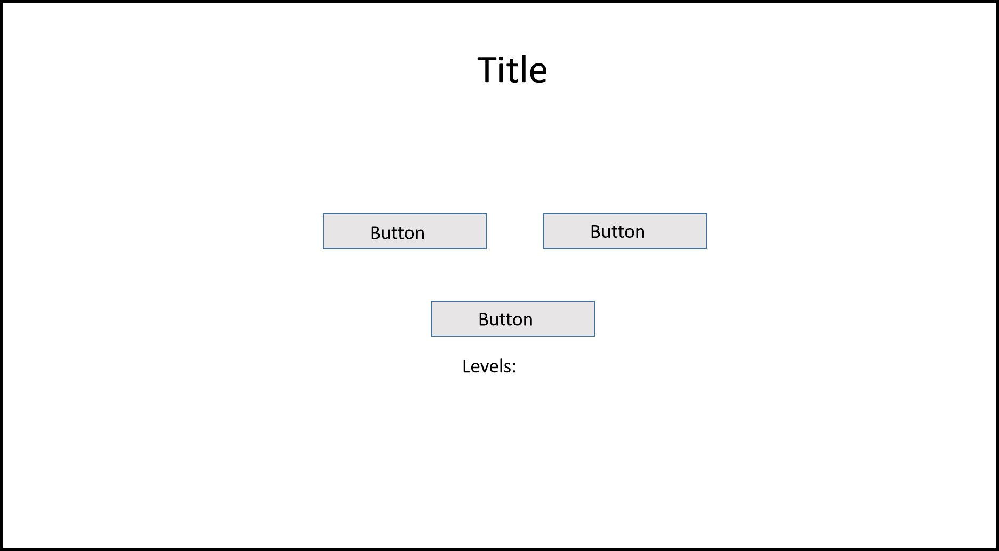
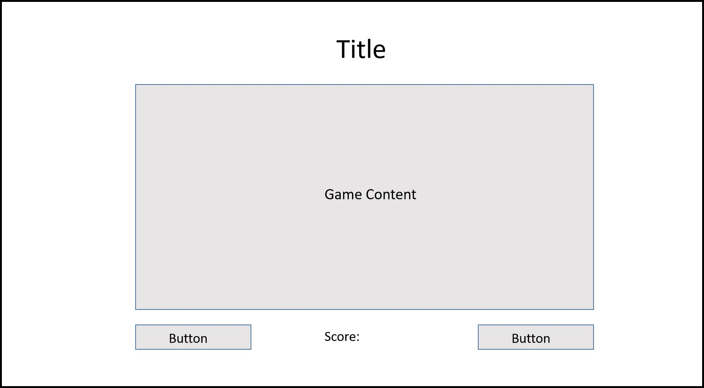
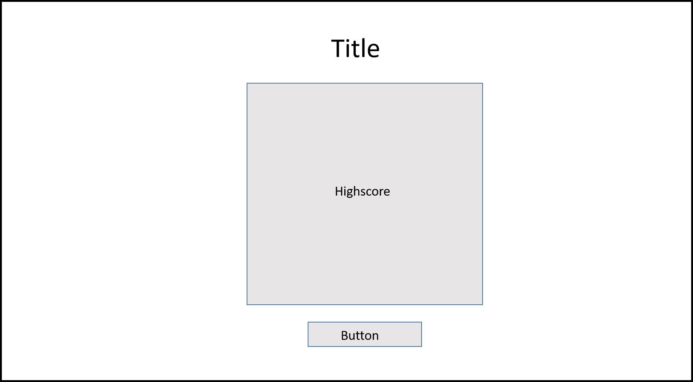

# TGC9-FrontEnd-Assignment2

Reactive Frontend Frameworks and RESTful API Development

## OBJECTIVE
In Assignment 2,  we neet to create an interactive web application using a reactive framework (such as Vue or React) and our own RESTful API using Mongo and Express.

# Title: Shoot The Ducks
A simple game to shoot the ducks that appear in the farm. This game will train the reaction and clicking accuracy of the players. Creating a fun and enjoyable training environment for first person shooter training.

# Strategy
A simple shooting game design webpage for user to access and train their shooting accuracy. It is also for people who have free time and looking for a enjoyable but stressfree game to get pass time.

## User's goals
To allow users to train their mouse accuracy and clicking speed and also be able to save their highscores and see how they ranked among other players. 
With the increase in First Person Shooting (FPS) games in the game market, this platform will allow users to train in a stress free environment their reaction time and speed.
This website will also provide as a platform for users to use it to get pass time or to have a way to destress.

### Target Audiences
As this site is set out for either skills training or casual/leisure gaming, the target audience of the site will be as follows:
* FPS gamers
* causal gamers
* Normal folks who wants to take a break from work or to relax for a few minutes

## Site's Owner goals
To enable the site to be brightly colored and striking visual. Allow easy navigations in the website and in game. To let the users have a clear direction of the interface and the gameplay.

# Scope
## Functional
Through this website, the user can hope to improve their aiming and clicking skills. 

User who just want to get pass time will find this site simple and a great way to help them destress.

## Content
As this is a single page application website, the content will be straight forward and simple. The main idea of the website is to let user dive right into the game and start playing straight away.

Some mandatory requirements will include:
* A button for 'New Game'
* A button for 'Highscore'
* Way for the user to input their score after every game.
* Access to the top 10 high scores played on the game.

## Content requirements
The following will be added into the website:
* Highscore
* New score input

## Features
In this assignment, I will be implenting a database from MongoDB to store the highscores of everyone that has played the game. Using Express and RESTful API, we will be able to see the scores history of past players and who has the highest score.
Hoping to bring the players a sense of accomplishment and achievments after they leave the website.

# Skeleton
The sekeleton of the game page will be a single page application using a reactive framework, VueJs.

Although it is a single page layout website, there will still be buttons for the users to click and interact with the page.  

The constant display and graphics on the website will be the title, which will always be shown and in the same position no matter what the users click from the website.

skeleton1

skeleton2

skeleton3

